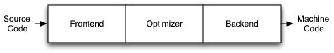
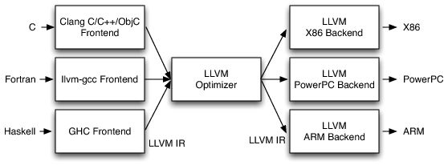
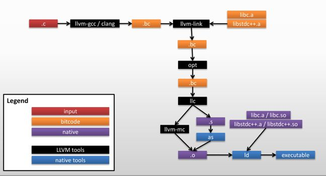

# LLVM


## 1. LLVM简介

LLVM是Low Level Virtual Machine的简称, 但其实是一个编译器的框架. 随着项目的不断发展, LLVM已经无法完全代表这个项目了, 只是这种叫法一直延续了下来.


### 1.1 LLVM IR

介绍LLVM IR之前, 我们先讲一下LLVM的结构. 

传统的静态编译器分为三个阶段, 分别是前端, 优化和后端: 

 

而LLVM的三个阶段是这样的:

 

这样做的优点是如果需要支持一种新的编程语言, 只需要实现一种新的前端. 如果需要支持一种新的硬件设备, 只需要实现一个新的后端. 而优化阶段因为是针对统一的LLVM IR, 所以它是一个通用的阶段, 不论是支持新的编程语言还是支持新的硬件设备, 这里都不需要对优化阶段做修改. 从这里可以看出LLVM IR的作用.

LLVM IR主要有三种格式: 一种是在内存中的编译中间语言, 一种是硬盘上存储的二进制中间语言(以`.bc`结尾), 最后一种是可读的中间格式(以`.ll`结尾). 这三种中间格式是完全相等的, 其中后两种可以用llvm-as, llvm-dis等工具进行转换.

关于LLVM IR, LLVM专门有一个文档进行介绍: [LLVM Language Reference Manual][1] 


### 1.2 LLVM

[Creating an LLVM Project][3]

[LLVM Link Time Optimization: Design and Implementation][6]


## 2. Clang

[Clang - Getting Started][2]

[Clang的架构, 编译选项和原理][4]

使用Clang编译`.c`文件的流程: 

 

[上图的出处及解释][7]


## 3. 编译LLVM + Clang(可选)

### Install dependencies

+ [x] `subversion`
+ [x] `gcc/g++ 4.8 or later`
+ [x] `cmake 3.4.3 or later`
+ [x] `libcap-dev`
+ [x] `libncurses5-dev`
+ [x] `python-minimal`
+ [x] `python-pip`
+ [x] `zlib1g-dev`
+ [x] `libxml2`

### 编译

1 - 10步请参考[官网][2]

其中第7步Build LLVM and Clang:

+ `mkdir build` (in-tree build is not supported)
+ `cd build`
+ `cmake -G "Unix Makefiles" ../llvm`
+ `make`
  + 对于后续针对Clang的开发, 可以只运行`make clang`

在执行make之前, 可以先看一眼[常见错误及解决方法](#常见错误及解决方法)中关于make时内存不足的问题. 

> 编译LLVM+Clang的话, 建议至少有100G硬盘空间和20G内存(算上交换区大小)


### 常见错误及解决方法

+ 如果提示cmake版本过低, 则需要升级cmake版本.


通过PPA安装的方法如下: 

```bash
sudo add-apt-repository ppa:george-edison55/cmake-3.x
sudo apt-get update
sudo apt-get install cmake3
cmake --version
```


+ 如果在`make`的Link阶段出现了`collect2: error: ld terminated with signal 9 [Killed]`这个错误, 则说明内存不足, 需要扩大内存(或者增加虚拟内存/扩大交换区的大小).

linux下扩大交换区大小的方法如下:

```bash
// 1. Create swap file
// 其中10GB是文件名可以随便起, count是总大小, 这里是1024*1024*10 = 10G
sudo dd if=/dev/zero of=/mnt/10GB.swap bs=1024 count=10485760
sudo chmod 600 /mnt/10GB.swap

// 2. Mount swap file.
sudo mkswap /mnt/10GB.swap

// 3. Enable swap file.
sudo swapon /mnt/10GB.swap

// 4. Check
sudo swapon -s

// 5. Make the change persistent across reboots
// add `/mnt/10GB.swap none swap sw 0 0` line to /etc/fstab
```

> 在make阶段, 可以先通过`make -j 9`并行完成, 然后当Link阶段崩溃时, 再通过`make -j 1`来减少链接阶段的内存消耗.


## 附录1: LLVM子项目和主要工具

### 1. 子项目

详情请见[LLVM官网][5]

+ LLVM Core
+ Clang
+ libc++
+ klee
+ ...


### 2. 主要工具

详细信息请参考官网[LLVM Command Guide][8]

+ llvm-config
  + 打印出配置时 LLVM 编译选项、库、等等 
+ llvm-as
  + 将人类可读的`.ll`文件汇编成字节代码 
+ llvm-dis 

  + 将字节代码文件反编成人类可读的`.ll`文件 
+ opt
  + 在一个字节代码文件上运行一系列LLVM到LLVM的优化 
+ llc

  + 为一个字节代码文件生成本机器代码 
+ lli

  + 直接运行使用 JIT 编译器或者解释器编译成字节代码的程序 
+ llvm-link

  + 将几个字节代码文件连接成一个 
+ llvm-ar

  + 打包字节代码文件 
+ llvm-ranlib 
  + 为 llvm-ar 打包的文件创建索引 
+ llvm-nm 
  + 列出LLVM 字节代码文件, 目标文件或包含他们的ar存档中的符号名称
+ llvm-prof 
  + 将`llvmprof.out` raw 数据格式化成人类可读的报告 
+ llvm-ld 
  + 带有可装载的运行时优化支持的通用目标连接器
+ llvmc 
  + 一个通用的可定制的编译器驱动 
+ llvm-diff 
  + 比较两个模块的结构 
+ bugpoint 
  + 自动案例测试减速器 
+ llvm-extract 
  + 从 LLVM 字节代码文件中解压出一个函数 
+ llvm-bcanalyzer 
  + 字节代码分析器 （分析二进制编码本身，而不是它代表的程序） 
+ FileCheck 
  + 灵活的文件验证器，广泛的被测试工具利用 
+ tblgen 
  + 目标描述阅读器和生成器 
+ lit LLVM 
  + 集成测试器，用于运行测试 
+ AddressSanitizer 
  + 一个快速内存错误探测器 


## 附录: 网址

[1]: http://llvm.org/docs/LangRef.html "LLVM IR介绍: LLVM Language Reference Manual"
[2]: http://clang.llvm.org/get_started.html "Clang教程: Getting Started: Building and Running Clang"
[3]: http://llvm.org/docs/Projects.html "LLVM教程: Creating an LLVM Project"
[4]: https://github.com/yejinlei/about-compiler/blob/master/%E6%9C%89%E5%85%B3LLVM.md "LLVM/Clang教程: 架构, 编译选项, 原理"
[5]: http://llvm.org/ "LLVM官网"
[6]: http://llvm.org/docs/LinkTimeOptimization.html "LLVM Link Time Optimization: Design and Implementation"
[7]: https://zhuanlan.zhihu.com/p/21889573 "LLVM编译.c文件的流程"
[8]: http://llvm.org/docs/CommandGuide/index.html "LLVM命令指南"

